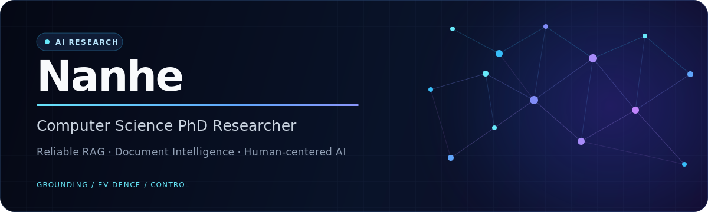

<div align="center">



<br />

**I build grounded, inspectable AI systems for knowledge, documents, and real-world workflows.**

[](https://github.com/nanhe-ai/AI-Freelance-30Day)
[](https://github.com/nanhe-ai/AI-Freelance-30Day/actions)

</div>

---

## Research thesis

> Capable AI is not enough. Production systems should be grounded in evidence, clear about uncertainty, and designed around human judgment.

I am a Computer Science PhD researcher working across **retrieval-augmented generation**, **document intelligence**, **knowledge systems**, and **human-in-the-loop automation**. My work connects research ideas with reliable software that people can inspect, evaluate, and use.

## Current focus

| Research direction | What I work on |
|---|---|
| **Reliable RAG** | Grounded retrieval, citation quality, evaluation, and evidence-aware refusal |
| **Document intelligence** | Extraction and validation pipelines for invoices, contracts, PDFs, and business records |
| **Human-centered automation** | Reviewable workflows that preserve control around consequential external actions |
| **Applied AI engineering** | FastAPI services, local-first systems, model integration, testing, and production-minded demos |

## Featured work

<a href="https://github.com/nanhe-ai/AI-Freelance-30Day">
  
</a>

### [Northstar Systems · AI Operations Portfolio →](https://github.com/nanhe-ai/AI-Freelance-30Day)

A cohesive portfolio of three independently runnable, local-first AI products. Each project includes an English interface, documented API, tests, sample data, Docker configuration, and a client-facing demo path.

| Product | Workflow | Trust boundary |
|---|---|---|
| **InquiryPilot** | Gmail inquiry → qualified lead → Sheets record → Gmail draft | Deduplication, explicit approval, draft-only automation |
| **ExtractFlow** | PDF, invoice, or contract → structured review queue | Source evidence, confidence scoring, validation, XLSX/CSV/JSON export |
| **CiteDesk** | Business documents → grounded multi-turn answers | File/page citations and low-evidence refusal |

## How I build

```text
Evidence before confidence  ·  Human review before external action
Local-first when privacy matters  ·  Clear handoff before hidden complexity
```

**Languages & systems**<br />
`Python` · `JavaScript` · `FastAPI` · `SQLite` · `Chroma` · `Docling` · `n8n` · `Docker`

**AI engineering**<br />
`RAG` · `Embeddings` · `Information Extraction` · `Evaluation` · `Prompt Engineering` · `OpenAI API`

## Collaboration

I am open to research collaboration and selective engineering work involving RAG, document processing, internal knowledge systems, and reviewable AI automation.

**Start with the working systems:** [code](https://github.com/nanhe-ai/AI-Freelance-30Day) · [product previews](https://github.com/nanhe-ai/AI-Freelance-30Day#product-previews) · [architecture](https://github.com/nanhe-ai/AI-Freelance-30Day#architecture) · [demo guide](https://github.com/nanhe-ai/AI-Freelance-30Day#quick-start-on-windows)

For a project conversation, open an issue with a short, non-confidential description of the workflow you want to improve. Please never include credentials, customer records, or private documents in a public issue.

<div align="center">

<sub>Reliable AI systems · Designed for evidence, control, and real use</sub>

</div>
